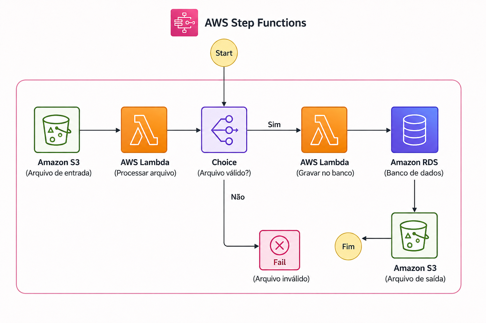

# Desafio DIO - AWS Step Functions

## Descrição

Este repositório foi desenvolvido como parte do laboratório da DIO com foco em **AWS Step Functions**. O objetivo do desafio foi compreender como criar e orquestrar fluxos de trabalho automatizados utilizando máquinas de estado na AWS.

---

## Objetivos de Aprendizagem

* Aplicar os conceitos aprendidos durante as aulas em um ambiente prático;
* Entender o funcionamento das AWS Step Functions;
* Documentar processos técnicos de forma clara e estruturada;
* Utilizar o GitHub como ferramenta de compartilhamento de conhecimento técnico.

---

## Arquitetura do Workflow

A imagem abaixo representa um exemplo simples de utilização do **AWS Step Functions**, integrando serviços como **Amazon S3**, **AWS Lambda** e um banco de dados para orquestração de processos automatizados.

  

  Exemplo de workflow automatizado utilizando AWS Step Functions, Amazon S3, AWS Lambda e banco de dados.

---

## O que são AWS Step Functions?

AWS Step Functions é um serviço totalmente gerenciado que permite coordenar múltiplos serviços da AWS por meio de **workflows visuais**, utilizando o conceito de **State Machines**.

Com ele, é possível:

* Orquestrar funções AWS Lambda;
* Integrar diversos serviços da AWS;
* Implementar fluxos de aprovação;
* Automatizar processos complexos;
* Tratar falhas e realizar retentativas automaticamente.

---

## Conceitos Aprendidos

### State Machine

Representa o fluxo completo da aplicação.

### States

São as etapas que compõem o workflow.

Tipos comuns:

* **Task** – executa uma atividade, como invocar uma função Lambda;
* **Choice** – adiciona decisões condicionais ao fluxo;
* **Wait** – pausa a execução por um período determinado;
* **Pass** – repassa dados para a próxima etapa sem processamento;
* **Succeed** – indica a conclusão bem-sucedida do workflow;
* **Fail** – encerra o fluxo em caso de falha;
* **Parallel** – executa múltiplas etapas simultaneamente;
* **Map** – processa uma coleção de itens iterativamente.

### Amazon States Language (ASL)

Linguagem baseada em JSON utilizada para definir o comportamento das máquinas de estado.

---

## Fluxo desenvolvido durante o laboratório

1. Recebimento ou identificação do arquivo de entrada;
2. Processamento inicial utilizando AWS Lambda;
3. Validação das informações recebidas;
4. Persistência dos dados em banco de dados;
5. Armazenamento do resultado do processamento;
6. Finalização e monitoramento da execução do workflow.

---

## Insights Obtidos

* Step Functions simplifica significativamente a orquestração de processos distribuídos;
* O monitoramento visual facilita a identificação de falhas;
* O tratamento de erros pode ser implementado diretamente no fluxo;
* A reutilização de componentes torna as soluções mais organizadas e escaláveis;
* A integração nativa com outros serviços AWS reduz a complexidade do desenvolvimento.

---

## Evidências

As capturas de tela utilizadas durante a execução do laboratório estão disponíveis na pasta `images`.

---

## Tecnologias Utilizadas

* AWS Step Functions
* AWS Lambda
* Amazon S3
* Banco de Dados Relacional
* AWS Management Console
* Git
* GitHub
* Markdown

---

## Conclusão

Este laboratório proporcionou uma visão prática sobre automação de workflows na AWS, demonstrando como as Step Functions podem ser utilizadas para construir soluções mais robustas, escaláveis e de fácil manutenção.

A experiência também reforçou a importância da documentação técnica como ferramenta de aprendizado contínuo e compartilhamento de conhecimento.

---

## Referências

* Documentação oficial da AWS Step Functions;
* Materiais disponibilizados pela DIO durante o curso;
* Documentação oficial do GitHub;
* Guia de Markdown do GitHub.
